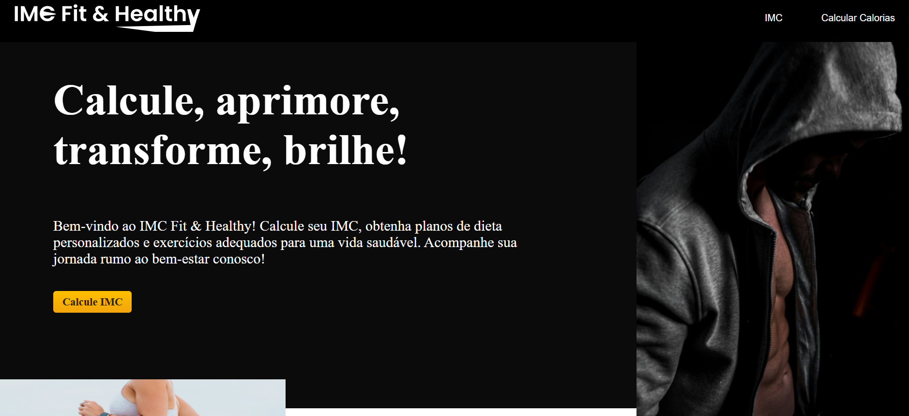

# Projeto IMC Fit & Healthy

Bem-vindo ao repositório do meu projeto!

Este projeto foi desenvolvido como parte de uma atividade do curso de Desenvolvimento Full-Stack do Senac Bauru. O IMC Fit & Healthy é uma aplicação simples e intuitiva, criada dentro do prazo limitado de tempo. O sistema tem como objetivo calcular o Índice de Massa Corporal (IMC) do usuário, além de estimar a quantidade de calorias gastas diariamente, de acordo com dados fornecidos, como peso, altura e nível de atividade física.
## Visual do Projeto

Aqui está uma captura de tela do Projeto:

